# PP2 - Javascript Essentials - Quizanaughts

Quizanaughts is an interactive quiz site designed to be fun and educational for 9-13 year old children, providing a way to test their space knowledge. It's purpose is to cover a wide variety of space questions to help the user test their knowledge in an interactive way. A compeitive component has been added by including a scoring system and timer to make it more fun and challenging. This quiz is a great educational tool as well as a way to create awareness about space and inspire future generations about the marvels of our planet and universe.  

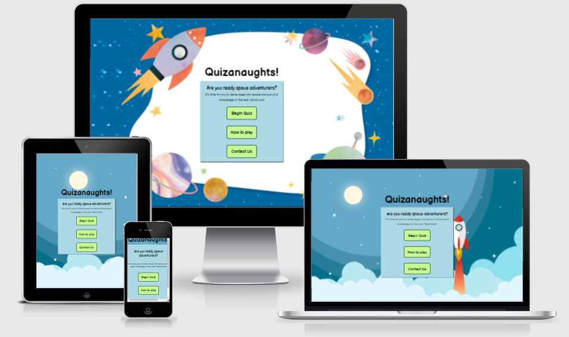

## Live Site

[Quizanaughts](https://jbachtiger.github.io/ci-pp2-quizanaughts/)

## Repository
[https://github.com/Jbachtiger/ci-pp2-quizanaughts](https://github.com/Jbachtiger/ci-pp2-quizanaughts)

## Table of Contents
- [User Experience (UX)](#user-experience)
  - [User Stories](#user-stories)

- [Design](#design)
  - [Colour Scheme](#colour-scheme)
  - [Typography](#typography)
  - [Wireframes](#wireframes)

- [Features](#features)
  - [Future Development](#future-development)

- [Technologies Used](#technologies-used)
  - [Languages Used](#languages-used)
  - [Frameworks, Libaries and Programs Used](#frameworks-libaries-and-programs-used)

- [Testing](#testing)
  - [Browser and Device Testing](#browser-and-device-testing)
  - [W3C and JSHint Validators](#w3c-and-jshint-validators)
  - [Colour Contrast Checks](#colour-contrast-checks)
  - [Lighthouse Tool](#lighthouse-tool)
  - [Solved Bugs](#solved-bugs)
  - [Known Bugs](#known-bugs)

- [Deployment](#deployment)

- [Credits](#credits)
  - [Code](#code)
  - [Media](#media)
  - [Acknowledgments](#acknowledgments)

## User Experience
### User Stories
__Project Goals__
- To engage children with an interactive quiz about space
- Teach children about space
- Inspire children to learn about space and the sciences
- To act as an educational resource for parents, teachers and schools
- To be fun and engaging

__Business Owner Goals__
- As a site owner I want to create a clean looking, fun, colourful and well structured website
- As a site owner I want to make it as easy as possible to navigate the website and allow players to play the quiz, find out the instructions as well as contact us
- As a site owner I want the children and players to have fun
- As a site owner I want the children and players to learn
- As a site owner I want the children and players to explore the topic of space
- As a site owner I want the children and players to provide feeback on quiz
- As a site owner I want to encourage children to take up the sciences and become curious  
      
__First Time Visitor Goals__
- As a first time visitor I want to find out what type of quiz it is
- As a first time visitor I want to find out how to play th quiz
- As a first time visitor I want be able to play the quiz quickly and easily
- As a first time visitor I want to be able to give feedback on the website easily 

 __Returning Visitors__
- As a returning visitor I want to be able to play the quiz immediately
- As a returning visitor I want to be able to get in contact quickly and easily

## Design
### Colour Scheme
- The colour scheme has been carefully chosen to ensure accessability for all
- The colours compliment each other to ensure a good contrast ratio
- The colours used provide a fun, colourful and child friendly look to the website
- The main colours used on the website are green, blue, white and orange inlcuding varying shades
- Hex codes for colours: #c3fc95 (Light Green), #add8e6 (Light Blue), #ffffff (White), #000000 (Black) and #FFA500 (Orange)

### Backgrounds
 - The website uses cartoony style space background throughtout to appeal to children and get them excited about the quiz
 - There are three different backgrounds in use for varying screen sizes

### Typography
- The website has imported Balsamiq Sans into the CSS file from Google Fonts
- This font has been chosen as it is easy to read and is child friendly
- The fallback family font is san-serif in cases where the main font has difficulty loading

### Wireframes
 - [Homepage](docs/wireframes/wireframe-homepage.png)
 - [Quiz Page](docs/wireframes/wireframe-quiz-page.png)
 - [Contact Us](docs/wireframes/wireframe-contact-us.png)

## Features 
- __Game Menu__

  - This is the main section of the website which includes the game UI. It is responsive and includes the begin quiz, how to play and contact buttons
  - The purpose of this section is to allow the user to navigate the game options easily across all devices without having to use a back button to get to the next page
  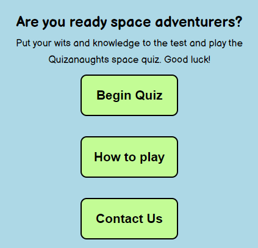

- __Title and Welcome Text__

  - As you enter the website, you are greeted with the quiz title and welcome text. This provides a quick overview of the theme of the quiz
  - The text has been written to appeal to children and is light hearted
  - The font styling has also been specifically chosen to appeal to children

  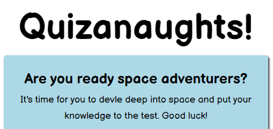

- __Begin Quiz Button__

  - The begin quiz button is the first button you see on the game menu and is in a promient green colour to stand out
  - Once the user clicks the begin quiz button this will take them to the questions and answers page to play the quiz

  

- __How To Play Button__

  - The how to play button is the next button you see in the game menu. This button is a pop-up modal which once clicked opens up a modal which contains the game rules.
  - The pop-up modal was used for this button to minimise the amount of clicks the player has to make to be able to go back to the game menu screen and play the quiz

  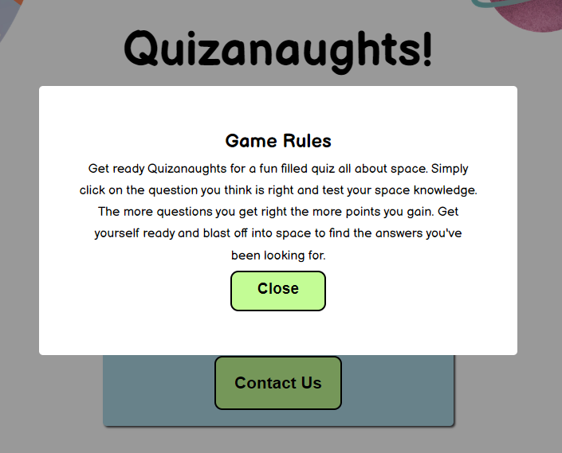

- __Contact Button and Form__ 

  - The contact button is the last button on the game menu and once clicked takes the player to a dedicated page which has a form on it
  - The form has been designed to be as short as possible, with only 3 fields to input (name, email and comments) and provides a way for the players to provice feedback
  - The form has box shadowing on it and a black border around the input fields to make them stand out
  - The form uses javascript to pre-populate information and on submit instead of the user being sent to the designated action URL as message displays to thank the player for their message and that a memeber of the team will get back to them shortly

  

  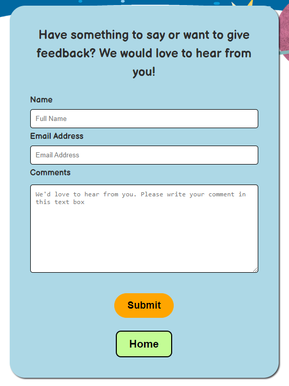

- __Main Quiz__
 -  The is the main quiz section that has all the questions and answers related to space
 - This part also contains the score, progress bar, countdown timer and question counter
 - It has been designed to be clear and intuitive
 - When a player clicks on an answer, it either turns green(correct) or red (incorrect) and then disables all other options so only one answer can be clicked per question
 - Each time an answer is chosen, a next button will appear to take the player onto the next question
 - If the countdown timer goes to 0 before all answers have been chosen, then a pop up message will be initiated displaying a better luck next time message. Once clicked, the answers and questions will disappear and be replace with a play again button. This will then lead to the quiz being reset once clicked

  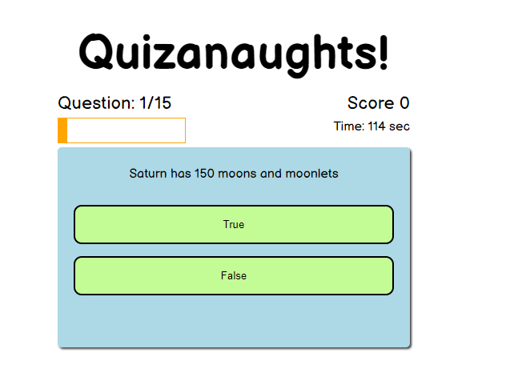

- __End Page For Quiz__
 - This is the section of the quiz that is displayed once the last question has been answered
 - It shows a congratulations message and dynamically inputs the score the user has achived
 - It also displays a home and play again button

  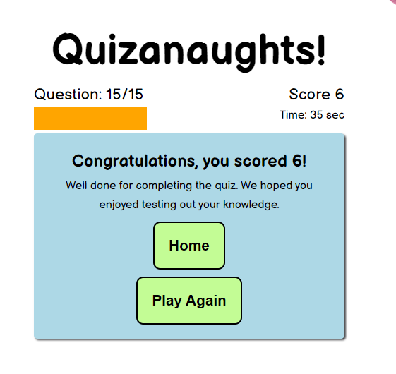

- __Question Counter__

  - The question counter provides a way for the player to know how many questions they have answered and what question they are on.
  - It makes it easier for them to judge how much of the quiz they have completed and how much time they can spend on all the remaining questions.
  
   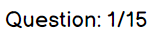

- __Progress Bar__
 
 - The progress bar is a visually appealing way to give quick snapshot of how far the player has progressed through the quiz.
 - This compliments the question counter and they both go hand in hand. 
 - The colour orange was chosen as it stands out and has good contrast compared to the other colours being used.
 - The progress bar dynamically fills up after each question has been answered

   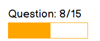

- __Score__

  - The score system works on a one point per correct question basis.
  - As you progress through the quiz the score is automtically updated in realtime as more and more correct questions are answered.
  - A score feature was added to bring more interactivity, increase the fun element and encourage healthy competition. 

   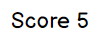

   - __Countdown Timer__

  - The question counter has been added to the main game quiz to add a bit more of a challenge element to the quiz and make it more enjoyable and rewarding to complete.
  - It counts down in seconds and gives the user 120 second to complete the who quiz. If the user doesn't manage this a play again option is displayed which resets the quiz for them to try again.

  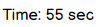

  ### Future Development
- Currently the form doesn't POST the users data to anywhere as i've not learned how to do this yet. In future, I would like to like this up properly
- Create a high score table with the ability for the player to input their username which saves their individal scores
- Add audio feedback when questions are answered are correct or wrong
- Create multiple levels where the questions get harder the higher the level
- Create a resources page that provides lots more education reading around the topic of space 

## Technologies Used
### Languages Used
- [Javascript](https://developer.mozilla.org/en-US/docs/Web/JavaScript)

- [HTML5](https://developer.mozilla.org/en-US/docs/Glossary/HTML5)

- [CSS3](https://developer.mozilla.org/en-US/docs/Web/CSS)

### Frameworks, Libaries and Programs Used
- [Gitpod](https://gitpod.io/projects) - this was my code editor for this project
- [Git](https://git-scm.com/) - was used for version control using the terminal through gitpod to commit to Git and push to Github
- [Github](https://github.com/) - is used to store the code for this project after being pushed from Git
- [Balsamiq](https://balsamiq.com/) - was used to create the wireframes during the design process
- [Google Fonts](https://fonts.google.com/) - used to import fonts to website
- [TinyPNG](https://tinypng.com/) - used to compress images
- [Canva](https://www.canva.com/) - used to edit and resize background images
- [GoogleDev Tools](https://developer.chrome.com/docs/devtools/) - was used to help investigate issues with code and visually see what code was related to which area on the page. The console function was also used for Javascript
- [Techsini](http://techsini.com/multi-mockup/index.php) - was used to generate multi-device website mockups
- [ColorSpace](https://mycolor.space/?hex=%23ADD8E6&sub=1) - used to generate colour pallets for use on website
- [a11y](https://color.a11y.com/) - used to check website colour contrast and accessibility
- [Fireshot](https://chrome.google.com/webstore/detail/take-webpage-screenshots/mcbpblocgmgfnpjjppndjkmgjaogfceg?hl=en) - this was a Google chrome extension used to take screenshots
- [HTML Formatter](https://webformatter.com/html) - used to double check all Javascript, HTML and CSS code was formatted correctly

## Testing 
- The main focus of the testing is on Javascript, HTML and CSS as these are the three languages that were used to create the quiz and static web pages
- The testing carried out ensures that the functionality and visual aspects of the website all work as intended
- Testing will be done using numerous devices and browsers, ensuring all UX is to a high standard as well as testing the websites accessibility, SEO and validation
- I have checked the following:

  - The overall website navigational experience, ensuring the main quiz UI is easy to use, there's  a clear logic flow to the menu and all pages can be accessed quickly
  - All internal links and modals work correctly
  - All forms are working as expected including script checks e.g. if a user fills in a mandatory field in a form an error message is shown, default values are being populated (using JS), optimally formatted for better readability
  - All JS code is being executed without any errors, the main quiz game is working as it should be as well as all of its extra features
  - Contrast checks should report no errors
  - Validation checks for HTML and CSS should report no errors 
  - Lighthouse test scores should be high (within 90-100 range)

### Browser and Device Testing
__Browsers__
- I have tested the website across the four major browsers including Goolge Chrome, Firefox, Microsoft Edge and Safari
- For each browser, functionality was tested including all quiz features that were built using Javascript, and the responsive design
- The website performed as intended and the responsive design and quiz functoins were checked using developer tools across multiple devices with structural integrity holding for the various sizes and no errors occuring

__Devices Tested__
The website was viewed on a variety of devices and screen sizes including:
- Windows 8.1 Desktop (screen resoultions tested in 2560x1080 and 1920x1080)
- Macbook Pro (13 inch 2015 version)
- Moto G4
- Galaxy S5
- Pixel 2
- Pixel 2 XL
- Iphone 5/SE
- Iphone 6/7/8
- Iphone 6/7/8 Plus
- Iphone X
- Ipad
- Ipad Pro
- Surface Duo
- Nest Hub
- Nest Hub Max

A large amount of testing was done to ensure all features of the quiz worked correctly, buttons worked and forms submitted as intended. Family members and the Code Institute Slack community was asked to review the website to point out any bugs or user experience issues.

### W3C and JSHint Validators
The official W3C Markup Validator was used to validate both the html and css of the project to ensure there were no syntax errors within the site. The JSHint code quality checker was used to ensure no errors were present within the javascript code. The links to the results for each html page, css stylesheet and javascript script are below.

1. W3C HTML Markup Validator

- [index.html](https://validator.w3.org/nu/?doc=https%3A%2F%2Fjbachtiger.github.io%2Fci-pp2-quizanaughts%2F)
- [contact.html](https://validator.w3.org/nu/?doc=https%3A%2F%2Fjbachtiger.github.io%2Fci-pp2-quizanaughts%2Fcontact.html)

2. W3C CSS Markup Validator 

- Validate css style for [index.html](https://jigsaw.w3.org/css-validator/validator?uri=https%3A%2F%2Fjbachtiger.github.io%2Fci-pp2-quizanaughts%2F&profile=css3svg&usermedium=all&warning=1&vextwarning=&lang=en)
- Validate css style for [contact.html](https://jigsaw.w3.org/css-validator/validator?uri=https%3A%2F%2Fjbachtiger.github.io%2Fci-pp2-quizanaughts%2Fcontact.html&profile=css3svg&usermedium=all&warning=1&vextwarning=&lang=en)

3. JSHint [https://jshint.com/]()

### Colour Contrast Checks
I have checked the color contrast of all the pages on the website including index and contact page using the Color Contrast Accessibility Validator by a11y. This ensured that best practise is followed regarding accessibility and maximised readability of the website. The results are shown below.

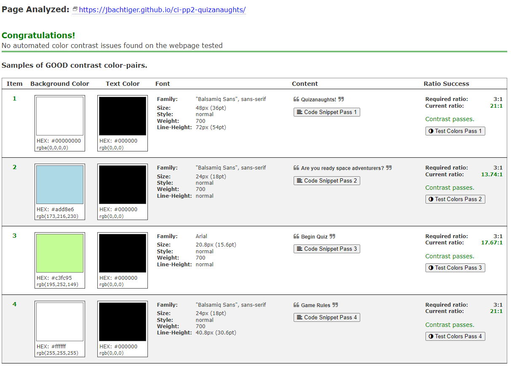

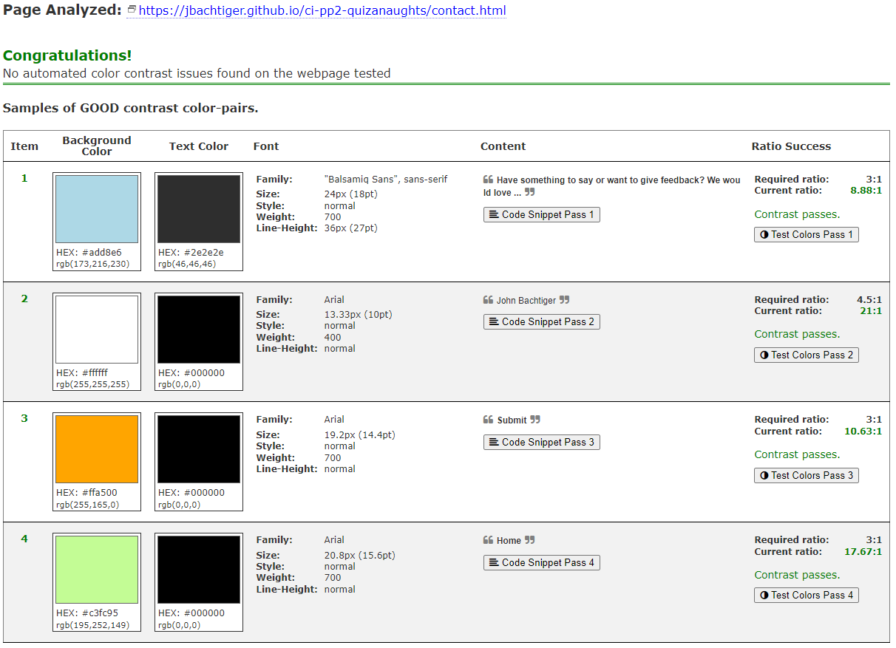

### Lighthouse Tool

I have used the Chrome Lighthouse tool to run a test and audit the entire website on mobile and desktop. The results are shown below.

- index.html
  - Desktop  
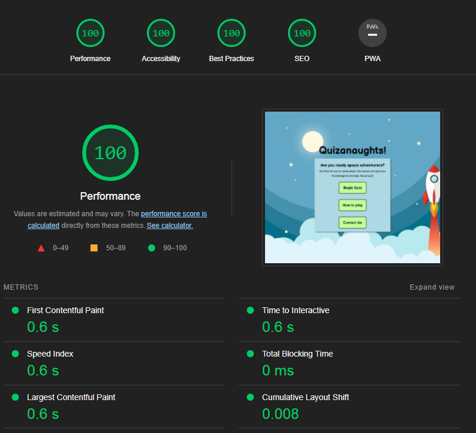

 - Mobile  
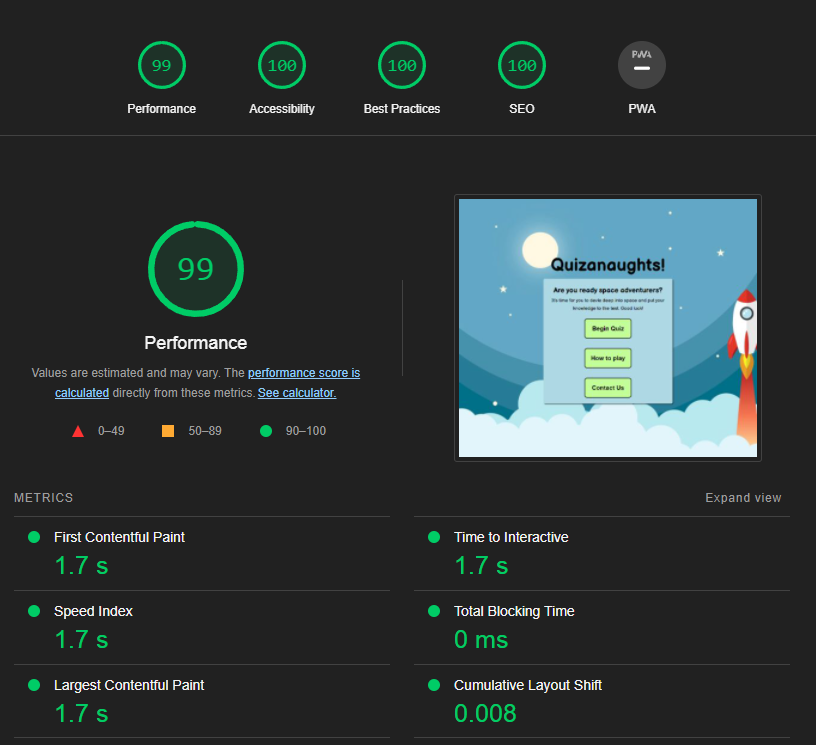

- contact.html
  - Desktop  
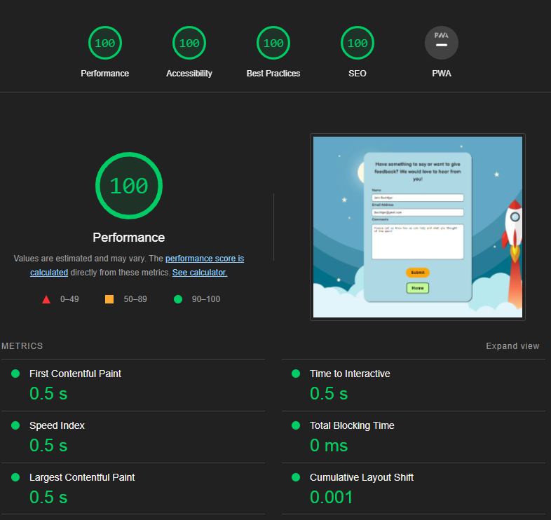

 - Mobile  
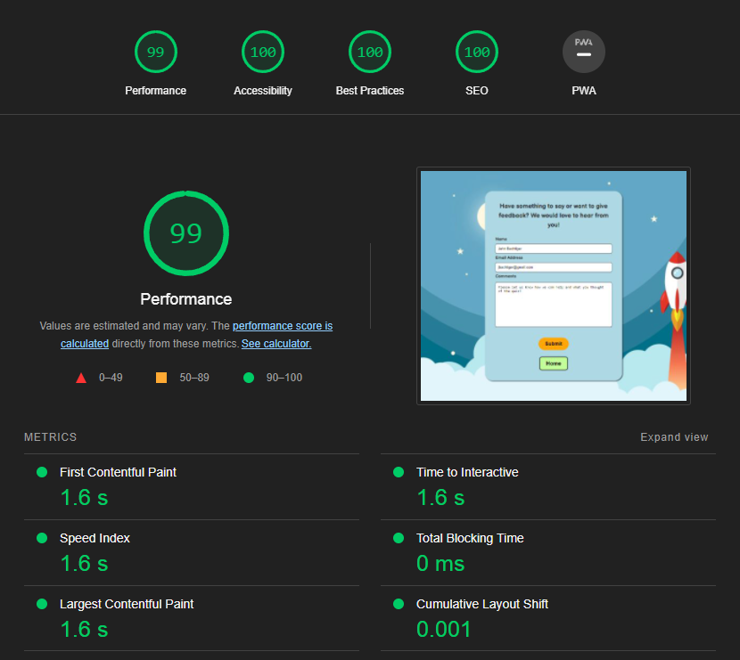

All pages have recieved a score no lower than 99 on all 4 categories of performance, accessibility, best practice and SEO showing it is well optimised. 

### Solved Bugs
1. The countdown timer text had a load delay when the begin quiz button was clicked. This offered poor user experience and as such needed to be fixed. This was achieved by adding the template literals code that was calling the timer text and countdown before the quizTimerRef set interval was called.
   - [Link to commit](https://github.com/Jbachtiger/ci-pp2-quizanaughts/commit/b56ce0e29d63bb2d16c5f7495e3a35269ea63a23)

2. The main quiz scoreing component was out of sync with the end screen congratulations score that is dynamically pulled usign a template literal. This only occurs when the player gets the last question right, meaing the template literal text is one point behind the main score text on the right of the quiz. To fix this the totalCorrectAnswersText variable that pulls the score was added to the endQuiz function to ensure the scores are pulled at the same time and match up.
   - [Link to commit](https://github.com/Jbachtiger/ci-pp2-quizanaughts/commit/aac8ceed44e34645f950a9d09d2599f769105e48)

3. An error occured with the home button on the contact us page. After further investigation, it turns out the form element was used instead of a input element with a type attribute of button. The form tags were replaced with a single input tag with a button type. This fixed the error.
   - [Link to commit](https://github.com/Jbachtiger/ci-pp2-quizanaughts/commit/43ed238871add9f4e55f3c8fa385bfed7c4e78be)

### Known Bugs
There are no known bugs left in this project.

## Deployment

This site was deployed to Github pages by following these steps:

1. Login/Signup to Github.
2. Navigate to relevant Github repository [here](https://github.com/Jbachtiger/ci-pp2-quizanaughts).
3. Click on the Settings tab, on the navigation menu under the repository name.
4. Scroll down the menu to the second to last item named "Pages" and click into it.
5. Under source, choose which branch to deploy. For our purposes choose main branch.
6. Choose the folder to deploy from, in this case /(root).
7. Click "Save" and wait for website to deploy. This can take a couple minutes.
8. Your URL will be display above "Source".

## Credits 
## Content
1. The question content for the quiz was sourced from a couple space related quiz websites:
- [twinkle.co.uk](https://www.twinkl.co.uk/homework-help/science-homework-help/earth-and-space/earth-and-space-quiz-for-kids)
- [sciencekids.co.nz](https://www.sciencekids.co.nz/quizzes/space.html)

2. The favicon came from [https://favicon.io/](https://favicon.io/)

### Code
1. Web Dev Simplified - the base code logic for the quiz was amended from his [Youtube](https://www.youtube.com/watch?v=riDzcEQbX6k) tutorial. The code has been modified extensively and extra features/components added to it.
2. Florin Pop [Youtube](https://www.youtube.com/watch?v=XH5OW46yO8I) video guide. The walkthrough helped create a modal and the code was used and modified for the project.

### Media
1. All stock images are royalty free and taken from the following sites:
- [Unsplash](https://unsplash.com/)
- [Raw Pixel](https://www.rawpixel.com/)
- [Pixabay](https://pixabay.com/)

Images used:
- Background for large screens: [Fun kids space](https://www.rawpixel.com/image/3061864/free-illustration-vector-space-colorful-background-kids-school)
- Background for medium screens: [Space Rocket Night Cartoon](https://pixabay.com/illustrations/space-rocket-night-cartoon-3262811/)
- Background for small screens: [Spaceman Spaceship Space Astronaught](https://pixabay.com/illustrations/spaceman-spaceship-space-astronaut-4160023/)

### Resources
1. [StackOverflow](https://stackoverflow.com/) - this website was used extensively to broaden my knowledge of Javascript
2. [CSS Tricks](https://css-tricks.com/) - this website was used to refresh on css concepts
3. Code Institute Tutor Support - I used tutor support a couple times to help steer me in the right direction to problems I can across with my javascript

### Acknowledgments
 - My mentor for their support, advice and patience when reviewing this project with me.
 -  The Code Institute slack community for always being on hand to ask questions and pointing me in the right direction.
 - My partner, for being so patient with me whilst creating this project and helping me test the quiz.  