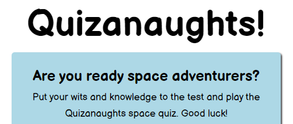

# PP2 - Javascript Essentials - Quizanaughts

Quizanaughts is an interactive quiz site designed to be fun and educational for 9-13 year old children, providing a way to test their space knowledge. It's purpose is to cover a wide variety of space questions to help the user test their knowledge in an interactive way. A compeitive component has been added by including a scoring system and timer to make it more fun and challenging. This quiz is a great educational tool as well as a way to create awareness about space and inspire future generations about the marvels of our planet and universe.  

## Live Site

[Quizanaughts](https://jbachtiger.github.io/ci-pp2-quizanaughts/)

## Repository
[https://github.com/Jbachtiger/ci-pp2-quizanaughts](https://github.com/Jbachtiger/ci-pp2-quizanaughts)

## Table of Contents
- [User Experience (UX)](#user-experience)
  - [User Stories](#user-stories)

- [Design](#design)
  - [Colour Scheme](#colour-scheme)
  - [Typography](#typography)
  - [Wireframes](#wireframes)

- [Features](#features)
  - [Future Development](#future-development)

- [Technologies Used](#technologies-used)
  - [Languages Used](#languages-used)
  - [Frameworks, Libaries and Programs Used](#frameworks-libaries-and-programs-used)

- [Testing](#testing)
  - [Browser and Device Testing](#browser-and-device-testing)
  - [W3C Validator](#w3c-validator)
  - [Colour Contrast Checks](#colour-contrast-checks)
  - [Lighthouse Tool](#lighthouse-tool)
  - [Solved Bugs](#solved-bugs)
  - [Known Bugs](#known-bugs)

- [Deployment](#deployment)

- [Credits](#credits)
  - [Code](#code)
  - [Media](#media)
  - [Acknowledgments](#acknowledgments)

## User Experience
### User Stories
__Project Goals__
- To engage children with an interactive quiz about space
- Teach children about space
- Inspire children to learn about space and the sciences
- To act as an educational resource for parents, teachers and schools
- To be fun and engaging

__Business Owner Goals__
- As a site owner I want to create a clean looking, fun, colourful and well structured website
- As a site owner I want to make it as easy as possible to navigate the website and allow players to play the quiz, find out the instructions as well as contact us
- As a site owner I want the children and players to have fun
- As a site owner I want the children and players to learn
- As a site owner I want the children and players to explore the topic of space
- As a site owner I want the children and players to provide feeback on quiz
- As a site owner I want to encourage children to take up the sciences and become curious  
      
__First Time Visitor Goals__
- As a first time visitor I want to find out what type of quiz it is
- As a first time visitor I want to find out how to play th quiz
- As a first time visitor I want be able to play the quiz quickly and easily
- As a first time visitor I want to be able to give feedback on the website easily 

 __Returning Visitors__
- As a returning visitor I want to be able to play the quiz immediately
- As a returning visitor I want to be able to get in contact quickly and easily

## Design
### Colour Scheme
- The colour scheme has been carefully chosen to ensure accessability for all
- The colours compliment each other to ensure a good contrast ratio
- The colours used provide a fun, colourful and child friendly look to the website
- The main colours used on the website are green, blue, white and orange inlcuding varying shades
- Hex codes for colours: #c3fc95 (Light Green), #add8e6 (Light Blue), #ffffff (White), #000000 (Black) and #FFA500 (Orange)

### Backgrounds
 - The website uses cartoony style space background throughtout to appeal to children and get them excited about the quiz
 - There are three different backgrounds in use for varying screen sizes

### Typography
- The website has imported Balsamiq Sans into the CSS file from Google Fonts
- This font has been chosen as it is easy to read and is child friendly
- The fallback family font is san-serif in cases where the main font has difficulty loading

### Wireframes
 - [Homepage](docs/wireframes/wireframe-homepage.png)
 - [Quiz Page](docs/wireframes/wireframe-quiz-page.png)
 - [Contact Us](docs/wireframes/wireframe-contact-us.png)

## Features 

- __Game Menu__

  - This is the main section of the website which includes the game UI. It is responsive and includes the begin quiz, how to play and contact buttons
  - The purpose of this section is to allow the user to navigate the game options easily across all devices without having to use a back button to get to the next page
  

- __Title and Welcome Text__

  - As you enter the website, you are greeted with the quiz title and welcome text. This provides a quick overview of the theme of the quiz
  - The text has been written to appeal to children and is light hearted
  - The font styling has also been specifically chosen to appeal to children

  

- __Begin Quiz Button__

  - The begin quiz button is the first button you see on the game menu and is in a promient green colour to stand out
  - Once the user clicks the begin quiz button this will take them to the questions and answers page to play the quiz

  

- __How To Play Button__

  - The how to play button is the next button you see in the game menu. This button is a pop-up modal which once clicked opens up a modal which contains the game rules.
  - The pop-up modal was used for this button to minimise the amount of clicks the player has to make to be able to go back to the game menu screen and play the quiz

  

- __Contact Button and Form__ 

  - The contact button is the last button on the game menu and once clicked takes the player to a dedicated page which has a form on it
  - The form has been designed to be as short as possible, with only 3 fields to input (name, email and comments) and provides a way for the players to provice feedback
  - The form has box shadowing on it and a black border around the input fields to make them stand out
  - The form uses javascript to pre-populate information and on submit instead of the user being sent to the designated action URL as message displays to thank the player for their message and that a memeber of the team will get back to them shortly

  

  

- __Main Quiz__
 -  The is the main quiz section that has all the questions and answers related to space
 - This part also contains the score, progress bar, countdown timer and question counter
 - It has been designed to be clear and intuitive
 - When a player clicks on an answer, it either turns green(correct) or red (incorrect) and then disables all other options so only one answer can be clicked per question
 - Each time an answer is chosen, a next button will appear to take the player onto the next question
 - If the countdown timer goes to 0 before all answers have been chosen, then a pop up message will be initiated displaying a better luck next time message. Once clicked, the answers and questions will disappear and be replace with a play again button. This will then lead to the quiz being reset once clicked

  

- __End Page For Quiz__
 - This is the section of the quiz that is displayed once the last question has been answered
 - It shows a congratulations message and dynamically inputs the score the user has achived
 - It also displays a home and play again button

  

- __Question Counter__

  - The question counter provides a way for the player to know how many questions they have answered and what question they are on.
  - It makes it easier for them to judge how much of the quiz they have completed and how much time they can spend on all the remaining questions.
  
   

- __Progress Bar__
 
 - The progress bar is a visually appealing way to give quick snapshot of how far the player has progressed through the quiz.
 - This compliments the question counter and they both go hand in hand. 
 - The colour orange was chosen as it stands out and has good contrast compared to the other colours being used.
 - The progress bar dynamically fills up after each question has been answered

   

- __Score__

  - The score system works on a one point per correct question basis.
  - As you progress through the quiz the score is automtically updated in realtime as more and more correct questions are answered.
  - A score feature was added to bring more interactivity, increase the fun element and encourage healthy competition. 

   

   - __Countdown Timer__

  - The question counter has been added to the main game quiz to add a bit more of a challenge element to the quiz and make it more enjoyable and rewarding to complete.
  - It counts down in seconds and gives the user 120 second to complete the who quiz. If the user doesn't manage this a play again option is displayed which resets the quiz for them to try again.

  

  